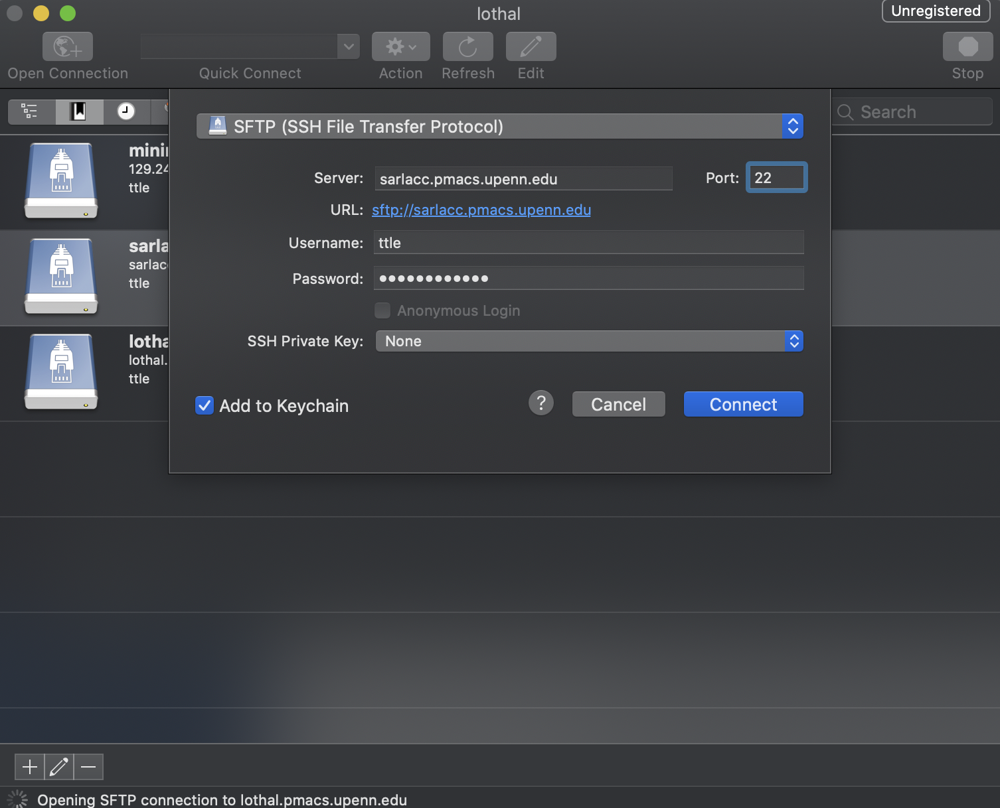

# LPC Documentation for the Epistasis Lab

*Written by members (and friends) of the lab.*

## Contents

- [LPC Documentation for the Epistasis Lab](#lpc-documentation-for-the-epistasis-lab)
  - [Contents](#contents)
  - [Introduction](#introduction)
  - [Links and other resources](#links-and-other-resources)
  - [Getting Started (e.g., new students)](#getting-started-eg-new-students)
  - [Logging into the LPC](#logging-into-the-lpc)
    - [Logging in from Linux:](#logging-in-from-linux)
    - [Logging in from Windows](#logging-in-from-windows)
    - [Logging in from MacOS](#logging-in-from-macos)
      - [Using Cyberduck](#using-cyberduck)
  - [Navigating the LPC from a command line](#navigating-the-lpc-from-a-command-line)
  - [Customizing your environment](#customizing-your-environment)
  - [Using queues](#using-queues)
  - [Submitting Jobs](#submitting-jobs)
  - [Best practices](#best-practices)
    - [TPOT cuML](#tpot-cuml)
      - [Installation for using TPOT-cuML configuration](#installation-for-using-tpot-cuml-configuration)
      - [Using TPOT-cuML in interactive mode](#using-tpot-cuml-in-interactive-mode)
      - [Sample job script for TPOT-cuML jobs](#sample-job-script-for-tpot-cuml-jobs)

  - [Miscellaneous tips](#miscellaneous-tips)
  - [Troubleshooting](#troubleshooting)
  - [LPC Commands Cheat Sheet](#lpc-commands-cheat-sheet)
    - [LSF (job scheduling system) commands](#lsf-job-scheduling-system-commands)
    - [PMACS software module commands](#pmacs-software-module-commands)
    - [Miscellaneous commands](#miscellaneous-commands)
    - [Sample job script](#sample-job-script)

## Introduction

The LPC (Limited Performance Computing) is a shared computing resource with a large number of processing cores upon which different computational tasks can be run.
The LPC can be used to run computing processes that require a larger amount of memory that most PCs or laptops have available, as well as to run many processes simultaneously (on separate computing cores) and thus parallelize a large number of computational tasks.
Each computing process (e.g., running a machine learning algorithm on a dataset), can be submitted (as a 'job') to an appropriate LPC queue (i.e. a program that manages the running of jobs from different users on cores of the LPC.
Each user of the LPC is set up with a home directory within which they can put the code or data they wish to run, and within which job outputs can be saved.
In order to use the LPC you will need to learn how to access it, how to navigate to your home directory, basic unix/linux commands, how to set up your 'environment' (so that the software, coding languages, and packages you will need are available to run your job, how to submit a job to a queue, how to manage and monitor your jobs, and best practices for LPC use.

## Links and other resources

- [PMACS Wiki - LPC](https://wiki.pmacs.upenn.edu/pub/LPC)

- [PMACS Wiki - LSF Basics](https://wiki.pmacs.upenn.edu/pub/LSF_Basics)

- [PMACS Wiki - Batch Computing](https://wiki.pmacs.upenn.edu/pub/Batch_Computing)

## Getting Started (e.g., new students)

- **Step 1: Get your PennKey and request LPC account access.** If you don't yet have a PennKey, please email medhelp@pennmedicine.upenn.edu to request one. Then, you can email Curt Calafut with your PennKey, CCing Jason, to request access to the LPC. You will be assigned an account username which will serve as the name of your home directory as well as be used to log onto the LPC.
- **Step 2: Set up VPN for off campus LPC access**.
Notes:The LPC can be accessed (i.e. logged on to) online directly while on campus, but in order to log on (specifically the Moore lab's sarlacc server) from off campus you will first need to connect to campus with a virtual private network (VPN).
  - First, make sure you enroll in [DUO Two-factor authentication](https://wiki.pmacs.upenn.edu/pub/HSRDC_Getting_Started#Duo_Two-Factor_Authentication). This is needed to access most online UPenn resources from off campus.
  - Next install the [Pulse Secure Software](https://www.med.upenn.edu/pmacs/assets/user-content/PMACS%20VPN%20%E2%80%93%20Mac%20OS%20Automated%20Install%20and%20Configuration%20(Preferred).pdf). Detailed instructions can be found [here](https://www.isc.upenn.edu/sites/default/files/pulse_secure_vpn_cc.pdf).
- **Step 2 Alternative: You can access the LPC from off campus without VPN**.
You can access either sciget.pmacs.upenn.edu or scisub.pmacs.upenn.edu without VPN and then from any of these you can ssh to sarlacc. You can also directly submit jobs to the LPC from scisub.pmacs.upenn.edu. Note however that there is talk about sciget and scisub only being available from the VPN in the future.
- **Step 3: Log onto VPN from off campus**. ([Instructions here](https://www.med.upenn.edu/pmacs/pulseduo.html)).

When each of these are complete, you should be able to log into the LPC using the instructions that follow. Note: You'll need to log into

## Logging into the LPC

To login to the LPC (and reach your home directory) you will need either a terminal program (i.e. command line) or (if preferred) a graphical user interface (GUI) program. These programs differ if you have Windows, Mac or Linux Machine. Please see the following link for your appropriate operating system and style of login:
https://wiki.pmacs.upenn.edu/pub/LPC  (Under 'Login Software Installation')
A specific Windows example is provided later in this section.
Once you have an appropriate program, you will use it to log on to a server (based on who you are affiliated with). This file server/host is a head node, from which you can navigate the LPC directories (including your home) and submit jobs.  There are currently two servers that may be relevant to this group for LPC job submissions, they are called scisub and sarlacc. For the Moore lab, sarlacc is generally recommended, but both will work in most cases.
sarlacc (sarlacc.pmacs.upenn.edu) is the Moore lab's submit host.  It is only accessible on campus or through VPN.  This server is 'beefier' than others and has its own dedicated cores and storage space. This allows users to run 'smaller' computing processes directly on this head node (but this should be avoided).  It also allows users to install and manage their own 'environment'.  For example if you wish to install the 'anaconda' package for running jobs you will need to log onto sarlacc.
scisub (scisub.pmacs.upenn.edu) is the submit host used by most LPC users.  It is open to the world (SSH only – i.e. a secure remote login protocol). From scisub you can also ssh to sarlacc.  Note that unlike sarlacc, scisub is a virtual host with limited computing power.  It cannot be used to run local processes or manually install environment packages. In addition, there are 2 other servers relevant to this group for the below tasks, but you cannot submit jobs to the LPC from these servers:
sciget (sciget.pmacs.upenn.edu): you can ssh to it and it has outbound network access. Primarily useful for wget, git, svn, etc.
transfer (transfer.pmacs.upenn.edu) is used for transferring files from LPC to a local machine (sftp, scp and rsync). You cannot ssh to it.

### Logging in from Linux:
`ssh username@sarlacc.pmacs.upenn.edu`

### Logging in from Windows

It is useful to install both the terminal and GUI software below.
The terminal is best for submitting jobs and the GUI is best for navigating and managing the file hierarchy and copying files to and from the LPC.

- **Windows (Terminal): [Putty](https://www.chiark.greenend.org.uk/~sgtatham/putty/)**
- **Windows (GUI): [WinSCP](https://winscp.net/eng/download.php)**

**Logging in with Putty:**
- Ensure you are connected to VPN via PulseSecure.
- Open the putty .exe file
- In the 'Session' window, enter `sarlacc.pmacs.upenn.edu` under 'Host Name'
- Confirm `'Port' = 22` and `'Connection type' = SSH`
- [For convenience] In the 'Connection/Data' window put the LPC username you were assigned into 'auto-login username'
- [For convenience] Go back to the 'Session' window and type in any session 'name' into 'Saved Sessions'. E.g. 'LPC_sarlacc'
- [For convenience] Click save, and this information will be available to be loaded your next time opening Putty
- Make sure you session is loaded and click 'Open' at bottom of the window
- A terminal will open up requesting your username (if you didn't save it in step 5).
- Lastly you will be prompted for your password.

**Logging in with WinSCP:**
- Ensure you are connected to VPN via PulseSecure.
- Open WinSCP software
- In the 'Session' window, enter `sarlacc.pmacs.upenn.edu` under 'Host Name'
- Confirm `'Port' = 22`, `'Connection type' = SSH`, and `'File protocol' = SFTP`
- Enter your username and password where indicated
- [For convenience] Click Save and give your session any name for future use.
- Click 'Login' to connect, and a GUI will open up allowing you to view both your local PC's directory as well as the directory on the LPC (it should open you up to your home directory the first time logging on).

Note that it is also possible to configure WinSCP to automatically open a putty terminal upon connection.

### Logging in from MacOS

As mentioned in the above section, while MacOS built-in terminal is sufficient for submitting jobs, the Cyberduck GUI can be helpful for navigating the file structure.

#### Using Cyberduck
- [Download](https://cyberduck.io/download/) Cyberduck
- Ensure you are connected to VPN via PulseSecure
- Open Cyberduck
- Select `Open Connection` on the top left
- In this window, select `SFTP (SSH File Transfer Protocol)`
- Enter `sarlacc.pmacs.upenn.edu` under `'Server'`
- Confirm `'Port' = 22`
- Enter your PMACS username and password
- Click `Connect`, and a GUI will open up allowing you to view the directory on the LPC (it should open you up to your home directory the first time logging on).



## Navigating the LPC from a command line

Linux commands are needed to navigate the LPC from a terminal (e.g. PuTTY).
See the following link for an overview of basic Linux commands:

https://wiki.pmacs.upenn.edu/pub/Linux_Basics

Some of the most commonly used basic commands include:

- `ls` (lists contents of current directory)
- `ls -a` (lists contents of current directory including hidden files)
- `cd somedirectory` (move from current directory to 'somedirectory')
- `cd ..` (move back one level in the folder hierarchy towards the root folder)
- `mkdir somedirectory` (make a new directory called `somedirectory`)
- `head myfile.txt` (show the beginning of a file)

A great tutorial on how to effectively use a Unix command line is available at https://missing.csail.mit.edu/.

## Customizing your environment

Depending on what you want to run on the LPC, you may need to install various applications, packages, programming language versions, etc.
To avoid confusion and keep things centralized, PMACS installs and manages common applications in a shared central directory that are available to all the hosts in our cluster.
The LPC terms these environmental elements as 'modules'.
Modules can be loaded or unloaded to be made available in your run environment.
This means that these modules will be available if you were to run a program locally on `sarlacc`, or when you submit a job from a given host (i.e., `sarlacc` or `scisub`).
Terminal commands for working with modules are available at this link:

https://wiki.pmacs.upenn.edu/pub/LPC#Modules

Alternatively if some application or package is not available or (for some reason) can't be installed by PMACS under modules, you can install such packages or applications in your home directory (assuming you are logged onto `sarlacc`!).
Be advised that PMACS provides very limited (if any) support when loading or using such installations on your own.

## Using queues

The first thing to understand before trying to schedule jobs are 'queues'.
At face value, a queue represents a set of pending jobs (i.e. a 'container' for jobs).
On the LPC different queues are available to different user groups allowing them to run their jobs.
You must be associated with, and have permission from, a specific user group in order to submit jobs to their associated queue.
Each queue is set up by PMACS with their own set of rules, defaults, and access to specific execute hosts (i.e. the servers comprised of computing cores where individual jobs are run).
Moore lab queues are described at the following link:

https://wiki.pmacs.upenn.edu/pub/Epistasis_lab

There are a few general queue types:

- `normal`: For most jobs.
- `long`: For long running jobs (more than 24 hr).
- `interactive`: For jobs that are run interactively.

More information on queues in general is available here:

https://wiki.pmacs.upenn.edu/pub/LSF_Basics

## Submitting Jobs

High performance parallel computing codes generally run in "batch" mode.
Batch jobs are controlled by scripts written by the user and submitted to a batch system that manages the compute resource and schedules the job to run based on a set of policies.
We use the term "job" to refer to a "batch job".

Computing 'jobs' can be submitted individually from the command line, or you can write and run an executable script to submit multiple jobs to a queue simultaneously.

**IBM's LSF documentation is available here:**
https://www.ibm.com/support/knowledgecenter/en/SSWRJV_10.1.0/lsf_welcome/lsf_welcome.html

## Best practices

### TPOT cuML

With "TPOT cuML" configuration (see <a href="../using/#built-in-tpot-configurations">built-in configurations</a>), TPOT will search over a restricted configuration using the GPU-accelerated estimators in [RAPIDS cuML](https://github.com/rapidsai/cuml) and [DMLC XGBoost](https://github.com/dmlc/xgboost). **This configuration requires an NVIDIA Pascal architecture or better GPU with [compute capability 6.0+](https://developer.nvidia.com/cuda-gpus), and that the library cuML is installed.** With this configuration, all model training and predicting will be GPU-accelerated. This configuration is particularly useful for medium-sized and larger datasets on which CPU-based estimators are a common bottleneck, and works for both the `TPOTClassifier` and `TPOTRegressor`.

#### Installation for using TPOT-cuML configuration
Please download this conda environment <a href="https://github.com/EpistasisLab/tpot/blob/master/tpot-cuml.yml">yml file</a></td> to install TPOT for using TPOT-cuML configuration.

```bash
conda env create -f tpot-cuml.yml -n tpot-cuml
conda activate tpot-cuml
```

#### Using TPOT-cuML in interactive mode of LPC
- setting environment

```bash
# so far only penncil1 has the GPU for TPOT cuML
bsub -Is -q gpu -m penncil1 -gpu "num=1" -n 1 'bash'
conda activate tpot-cuml
ipython
```
- running a quick TPOT-cuML demo in iPython

```python
from tpot import TPOTClassifier
from sklearn.datasets import make_classification
from sklearn.model_selection import train_test_split
NSAMPLES = 500000
NFEATURES = 500
SEED = 12

# For cuML with TPOT, you must use CPU data (such as NumPy arrays)
X, y = make_classification(
    n_samples=NSAMPLES,
    n_features=NFEATURES,
    n_informative=NFEATURES,
    n_redundant=0,
    class_sep=0.75,
    n_classes=2,
    random_state=SEED,

)

X = X.astype("float32")

X_train, X_test, y_train, y_test = train_test_split(X, y, stratify=y, random_state=SEED)
GENERATIONS = 10
POP_SIZE = 50
CV = 5

tpot = TPOTClassifier(
    generations=GENERATIONS,
    population_size=POP_SIZE,
    random_state=SEED,
    config_dict="TPOT cuML", # this will using TPOT cuML
    n_jobs=1, # cuML requires n_jobs=1, the default
    cv=CV,
    verbosity=2,
)

tpot.fit(X_train, y_train)
print(tpot.score(X_test, y_test))
```

#### Sample job script for TPOT-cuML jobs


```bash
#!/bin/bash
#BSUB -J myjobname
#BSUB -o outputfile.%J.out
#BSUB -e errorfile.%J.err
#BSUB -q gpu
#BSUB -n 1
#BSUB -gpu "num=1"
#BSUB -m penncil1
#BSUB -M 60000
conda activate tpot-cuml
cd /project/moore/users/myhomedirectory
python test_cuml.py
```

## Miscellaneous tips

[TODO]

To avoid accidental deletion or overwriting of files it is recommended that you put these aliases in your .bashrc:

- alias rm='rm -i'
- alias mv='mv -i'
- alias cp='cp -i'

Each of these will prompt linux to ask you confirmation for the corresponding action.

## Troubleshooting

If you have any question, you could email Curt. Curt's email address: calafutc@upenn.edu.
It's also a good idea to provide your ip address when asking a question regarding connection: http://www.med.upenn.edu/myip.
If there is still issue connecting to sarlacc, try emptying the contents of the `~/.ssh/known_hosts` file.

## LPC Commands Cheat Sheet

### LSF (job scheduling system) commands

| Command | Description |
|---------|-------------|
| `bjobs` | Show unfinished jobs |
| `bjobs -sum` | Summarize active jobs |
| `bjobs -u ryanurb` | Show jobs for user `ryanurb` |
| `bkill 12345` | Kill job with ID `12345` |
| `bkill 0` | Kill all jobs that belong to you |
| `bhosts doi_exe` | Show server hosts |
| `bhosts` | Show all hosts |
| `bswitch` | Switch a job to a different queue |

Some other LSF commands can be found [here](https://www.med.upenn.edu/hpc/assets/user-content/documents/lsf-quick-reference_user_commands.pdf).

### PMACS software module commands

| Command | Description |
|---------|-------------|
| `module list` | List loaded modules |
| `module avail` | List all available modules |
| `module avail python` | List available python modules |
| `module load python/3.7` | Loads the module named `python/3.7` |
| `module unload python/2.7.10` | Unloads the module named `python/2.7.10` |
| `module switch gcc/4.9.4 gcc/6.2.0` | Swap out module `gcc/4.9.4` for `gcc/6.2.0` (useful for changing software versions) |

### Miscellaneous commands

| Command | Description |
|---------|-------------|
| `df -h` | Get current disk usage and total disk capacity |
| `du -hs` | Get size of current directory |

### Sample job script

```bash
#!/bin/bash
#BSUB -J myjobname
#BSUB -o outputfile.%J.out
#BSUB -e errorfile.%J.err
#BSUB -q epistasis_normal
#BSUB -M 10000
module add python/3.7
cd /project/moore/users/myhomedirectory
python3.7 script.py -parA 0 -parB value
```

Assuming this is saved to a file named `script.sh`, you can submit the job by running:

```bash
$ bsub < script.sh
```
